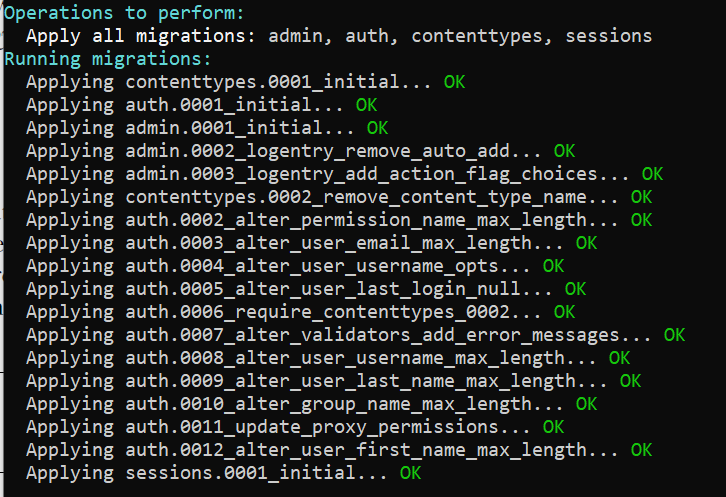
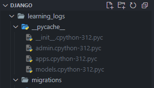
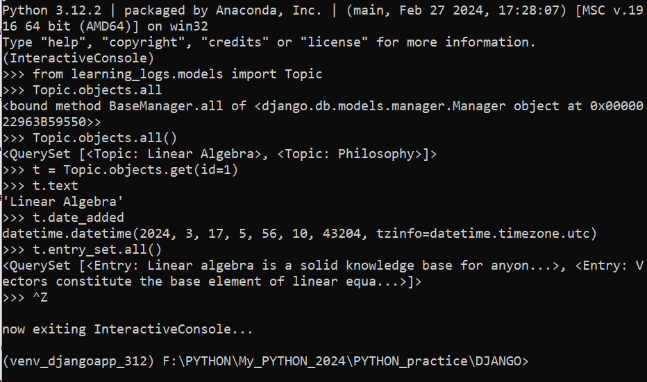
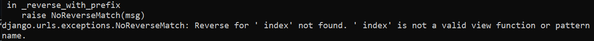
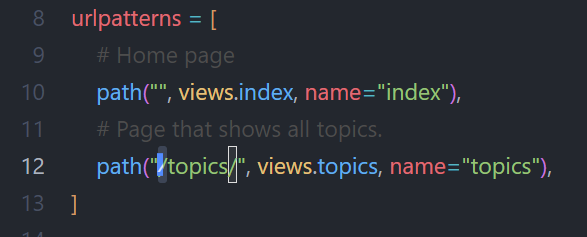
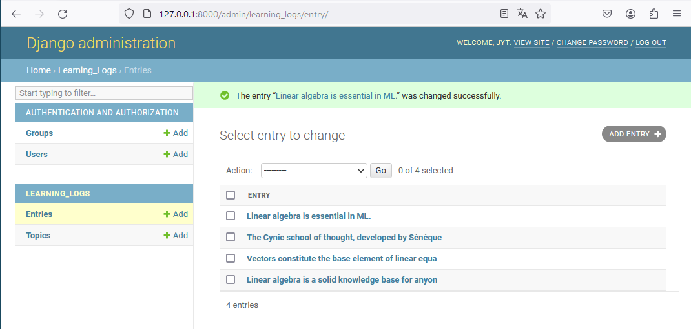

# WHAT I LEARNT

### Project Details:

- Virtual Environment: conda v24.1.2
- Django: v4.1  
  
  

---

## Security & .env file

So before I wrote this paragraph I published this whole project as a new repository on github and only after that I discovered that some sensitive information was present in the settings.py file. It was even mentioned there but I did not pay attention to it.  
Also I continued learning from the book and the next step is to create a superuser, with passwords. And that of course rose some concerns about security. Now, Github do use hashing to hide the password but that did not fix the settings.py sensitive info.  
But the package dotenv, .env file and the .gitignore file do. This way I keep the sensitive info locally on my .env file as it is not committed due to being gitignored. 

So I went through a good hour of tuts on YT and learnt about dotenv and how to use it with an .env file.  And this project now has an .env file. 

And this also meant to gitignore the database file as it is a best-practice when it comes to security.  
All of these measures are ok for a project like this because this is just me doing it on my own. Other solutions are to be used once this becomes a team work (I'm looking at github secrets). 

## Gitignore to Keep Files Local

When working with a team, not everything in a project file should be sent via a commit. This is true for temp files, and files that are repetitively regenerated, like the .pyc files. 

Nothing hard in itself, but here in my case, I wanted to add .pyc files after I sent them via a previous commit. And this meant that now these files won't be gitignored by simply adding them to the .gitignore file.  
The solution is to use a special command prompt in the CLI: `echo "whatever_file_path/or_file_name" >> .gitignore`. Followed by: `git rm --cached whatever_file_path/or_file_name`. Then add to the staging and commit. This is how I successfully gitignored all my .pyc files.

---

## Command Line Interface to Setup the Django Project

So the instructions I followed made me use the CLI, on my Windows PC. The commands are very specific and as such I'll just have to go through them again for every new Django project.  
So far I was able to avoid it for creating my virtual environments through the anaconda navigator GUI and the practicality of VScode.  

I knew that  the CLI was an unavoidable tool, so I was prepared to use it. I guess I am just stating the obvious here, that a CLI is not a GUI, and as such it's a lot less intuitive and potentially more time consuming. But I'll come back to that at the end of the next point.

### Simplified Complexity of a Web Project

One huge advantage of Django is that it does for us a lot of the prep work needed for any web project. This [video](https://youtu.be/t_p4ZyAYyaY?si=LncDxgfSIUhYuVij) here from one of IBM's YT channels explains it very clearly.  
And to sum it up, Django is handling for us: 
- import of HTTP library
- port choice
- expose an import method (I do not know what it means)
- listen to the method using that chosen port
- write a response to that method
- keep the server running to keep this process going

So this is not your typical basic code stuff that any one could do and/or understand.  
AND, this prep work is needed for EVERY new project. So with Django, we're looking at a lot of time saved. Now you should understand why it is so used for prototyping: 
- the speed 
- and the absence of the potentially repetitive prep friction 
  - that could negatively impact our motivation rigth from the get-go

So at the end of the day, using the CLI to setup a Django project instead of a GUI from your IDE (and I am not sure it is possible) is still saving yourself time, even if you are learning how to use the CLI. 

### Necessity to Understand the Web

And we are coming to a crucial point here. Creating web apps demands at least a good understanding of how the web works. And my coding education on HTML/CSS and JavaScript, though rusty, helped me not feel completely out of my comfort zone here. But a refresher would not hurt, for sure. 

### Models, Migration & Database

So when working with Django, one of the basic process is to create a model, which is an object that has the properties we want to create one visual (or not) part of the app. And the app itself, is actually one big functionality of what your final app could or would be. The default project created by Django already has default apps installed, and we need to add ours (folder 'learning_logs') in that list too (it is an actual list `[]`) in the settings.py file.
  
Then the model has to be prepared for migration and then it needs to be migrated to the database. And this is the basic procedure of developing the app. 

### Django Shell

Because this is a web app project, it becomes more complex to test and find errors. Instead of going back and forth from the IDE to the web pages, we can use the shell to test out the app and potentially find errors. 

---

## URLs pattern & Request Handler (views.py)

The procedure is well known today. In a browser you request a URL, your browser check your app API and send a response with everything needed to render that URL. And this response often is HTML/CSS and JS code (so front-end languages).  
Django is not a front-end framework, but it can still use these via the concept of templates that are written with template tags: ``.  
However these templates are not typically used by back-end developers, nor by front-end ones, as they are better off using front-end frameworks. 

### Weird Error Message

As I was going through the book, I encountered an **error message**: 

I spent the next hour to figure out what happened, to triple check my code without any success. I decided to turn to claude.ai for help. And it told me the solution: a single '/' was missing, and the book **DID NOT** mention that.  
I am guessing this is **due to the fact that I am on a Windows machine...** Linux machines probably do not have this kind of errors...  

So this was **related to the pattern definition in the urls.py file** of the app  learning_log (line 12):

Without the first `'/'` before topics/ this would return the error message.  
What happened is that **without this first '/'** Django just thinks that the **URL topics/ is part of the URL of index**. And because the requests handler (views file) was set up to see it as a root and so not as part of the index URL, this is not working.  

--- 

## Title 3

Text

--- 

## How Well Did I do?

After I compared my code to the solutions: 
- **exercise 18-2**:  
  
  

  GRADE: Text. 

- **exercise **:  
  Text. 

- **exercise **:

#### Resources:
Python Crash Course 3rd Ed.: [solutions to exercises 8-8 to 8-10](https://ehmatthes.github.io/pcc_3e/solutions/chapter_8/#8-9-messages)  
IBM YT Channel: [What is a Relational Database](https://youtu.be/OqjJjpjDRLc?si=jdfqb3Qq0sBP6oJt)  
Christopher Kalodikis YT Channel: [Relational Database Relationships](https://youtu.be/C3icLzBtg8I?si=_jvxtgWdONobDNnb)  
Decomplexify YT Channel: [Database Keys Made Easy](https://youtu.be/8wUUMOKAK-c?si=XuHPVhF4WNatinFO)  
Programming With Mosh YT Channel: [Python Django Tutorial for Beginners](https://youtu.be/8wUUMOKAK-c?si=XuHPVhF4WNatinFO)
